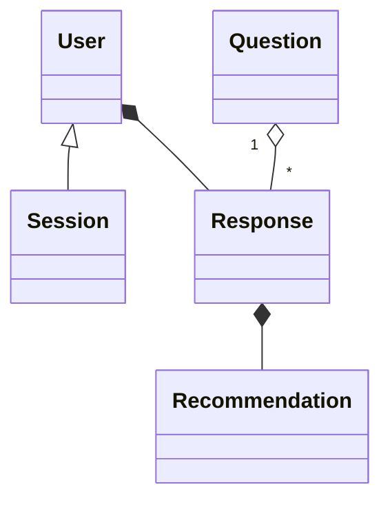

    # Product Requirements Document (PRD)

## 1. Purpose & Background

Small‑ and medium‑size businesses often struggle to understand *whether* and *where* AI or automation can provide measurable ROI. The **AI Workflow Assessment Tool** is an interactive, Next.js‑based questionnaire that analyzes a company’s answers in real time with LLM reasoning, surfaces the best‑fit AI/automation opportunities, and quantifies potential time and cost savings. The app also functions as a robust lead magnet by capturing qualified contact details for later nurturing via email.

## 2. Goals & Non‑Goals

| ID   | Goal                                                                          | Success Metric                                                                 |
| ---- | ----------------------------------------------------------------------------- | ------------------------------------------------------------------------------ |
| G1   | Help users identify at least one high‑impact AI/automation use case           | ≥ 80 % of completed assessments present ≥ 1 recommendation rated “High Impact” |
| G2   | Quantify ROI potential                                                        | 90 % of recommendations include time *and* cost estimates                      |
| G3   | Lead generation                                                               | ≥ 60 % of authenticated users opt in to mailing list                           |
| G4   | Survey completion rate                                                        | ≥ 70 % of authenticated users finish the questionnaire                         |
|  NG1 | The tool will NOT implement the recommended automations—only surface insights |                                                                                |

## 3. Target Users

* **Primary:** Owners/decision‑makers of SMBs (5‑200 staff) in services & trades looking to cut admin overhead.
* **Secondary:** Consultants or agencies vetting AI solutions for clients.

## 4. Key Features

| Priority | Feature                    | Description                                                                                                 |                                                                                                   |
| -------- | -------------------------- | ----------------------------------------------------------------------------------------------------------- | ------------------------------------------------------------------------------------------------- |
| P0       | **Secure Authentication**  | Clerk (preferred) or BetterAuth for email/social login; adds user to *prospects* collection.                |                                                                                                   |
| P0       | **Dynamic Questionnaire**  | Mix of MCQ, Likert scale, and free‑text (≈ 15 questions in ≤ 7 minutes). Conditional branching by industry. |                                                                                                   |
| P0       | **Real‑time LLM Analysis** | Stream responses to OpenAI function calls; return impact ranking + tailored advice instantly.               |                                                                                                   |
| P0       | **Savings Calculators**    | Inline widgets (e.g., hours/week × hourly wage) feeding the LLM context.                                    |                                                                                                   |
| \$1      | P1                         | **Voice I/O (Whisper + TTS)**                                                                               | Users can dictate answers and listen to text‑to‑speech playback of questions and recommendations. |
| P1       | **Admin Dashboard**        | View aggregated insights, export CSV, tweak questions (phase 2).                                            |                                                                                                   |
| P2       | **Benchmarking**           | Compare user data to anonymized cohort averages.                                                            |                                                                                                   |

## 5. User Stories (excerpt)

1. **Owner**: “As an HVAC business owner, I want to know which back‑office tasks can be automated so that I can spend more time on jobs.”
2. **Consultant**: “As a digital consultant, I want an emailed PDF of the recommendations to share with my client.”

## 6. UX Requirements

* One‑page wizard with progress bar and autosave.
* Mobile‑first design (≥ 375 px).
* WCAG AA contrast, keyboard‑accessible.
* Optional voice mode: mic button for dictation and speaker icon for TTS playback.
* Toasts/snackbars for async actions (saving, emailing).

## 7. Technical Architecture

* **Frontend:** Next.js 14 App Router, React 18, TypeScript, Tailwind CSS, shadcn/ui.
* **Auth:** Clerk → JWT → Middleware route protection.
* **Backend/API:** Next.js Edge + server actions calling OpenAI Assistants.
* **Email:** Resend + React email template.
* **Database:** Prisma ORM **+ Prisma Data Proxy** → default to **Vercel Postgres free tier** for MVP; consider **Neon Postgres** or **PlanetScale MySQL** if they prove more cost‑effective or scalable. *Avoid Supabase free tier* due to frequent project deactivation; MongoDB Atlas remains a secondary option if pricing beats Postgres offerings.
* **LLM:** OpenAI GPT‑4o (primary), with function‑calling for calculators.
* **Voice I/O:** Whisper (speech‑to‑text) and OpenAI TTS (text‑to‑speech) APIs.
* **Hosting:** Vercel. Secrets via Vercel Environment Variables.
* **CI/CD:** GitHub Actions + ESLint/Prettier + tRPC types.

## 8. Data Model (simplified)

* **User**: id (uuid), email, name, role, createdAt
* **Question**: id, text, type, options
* **Response**: id, userId, questionId, answer, calcInputs
* **Recommendation**: id, userId, area, summary, impactScore, timeSavedHrs, costSavedUSD

## 9. Analytics & Metrics

* Vercel Analytics + PostHog.
* Track: page views, drop‑off question index, avg. completion time, email‑click rate.

## 10. Security & Compliance

* SOC 2‑compliant vendors (Clerk, Resend, Vercel).
* GDPR‑ready: consent checkbox, data export/delete endpoint.

## 11. Timeline & Milestones

| Week  | Milestone                                |
| ----- | ---------------------------------------- |
| 0‑1   | Discovery, finalize question set         |
| 2‑3   | Auth & DB schema                         |
| 4‑5   | Questionnaire UI, calculators            |
| 6‑7   | LLM integration & recommendations engine |
| 8     | Email + clipboard share                  |
| 9     | QA, accessibility audit                  |
| 10    | Beta launch                              |
| 11‑12 | Feedback & hard launch                   |

## 12. Risks & Mitigations

| Risk                | Impact       | Mitigation                          |
| ------------------- | ------------ | ----------------------------------- |
| OpenAI latency      | Poor UX      | Use streaming; cache common outputs |
| Low completion rate | Fewer leads  | Keep survey ≤ 7 min; show progress  |
| GDPR non‑compliance | Legal issues | Add DPA; clear privacy copy         |

## 13. Recent Decisions

1. **Calculators:** Include both *time* and *cost* savings calculators in the MVP; defer error‑reduction metrics to a later phase.
2. **PDF export:** Omit from MVP and schedule for Phase 2.
3. **Industry flow:** Begin the questionnaire by asking the user's industry and branch subsequent questions dynamically based on that answer rather than selecting from a pre‑defined granular list.
4. **Database cost & stability:** Default to Vercel Postgres (via Prisma Data Proxy) to prevent idle‑project shutdowns seen on Supabase. Re‑evaluate pricing monthly; switch to Neon, PlanetScale, or MongoDB Atlas if total cost of ownership is lower.
